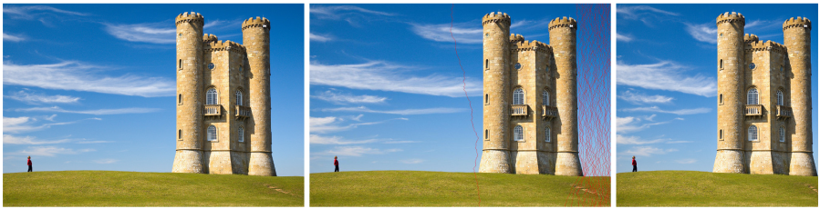

# Scaling

In the task you need to implement an algorithm, being used for content-aware image resizing. The algorithm consider content of the image, so deformation doesn't change sizes of objects on the image. Besides, we can highlight some objects on the image using mask, so they will be removed or will remain unchanged.

The main idea of the algorithm is to remove "seams" with the lowest energy. An energy of a point is calcultaed as brightness gradient module at the point. So, in the algorithm we need to find the seam passing throw the points with minimal total energy.

Solution for the task is presented in jupyter-notebook **[scaling.ipynb](scaling.ipynb)**. Python code for the solution you can find in **[seam_carve.py](seam_carve.py)**.

You can test the functions using **[run.py](run.py)** and **[public_tests](public_tests)** located in the same folder: \
**`$ ./run.py public_tests`** \
***NB:*** you might have to change python3 interpretator in **[run.py](run.py)** (for example I have changed it to **/home/valeriy/anaconda3/bin/python3**).

A whole task description is available only in Russian. You can find it in **[WholeTaskDescription.pdf](WholeTaskDescription.pdf)**.
