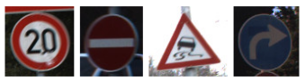

# Signs Detection

It is the first task on machine learning algorithms. In the task you are offered to implement an SVM-algorithm for signs detection using Histograms of Oriented Gradients as descriptors.

Solution for the task is presented in jupyter-notebook **[signsDetection.ipynb](signsDetection.ipynb)**. Python code for the solution you can find in **[fit_and_classify.py](fit_and_classify.py)**.

In the task students were offered to train their models on a public sample and then the model were tested on a hidden sample. The solution above has an accuracy of **~0.996** on the training sample and **~0.95** on the test (hidden) sample.

You can test the functions using **[run.py](run.py)** and **[public_tests](public_tests)** located in the same folder: \
**`$ ./run.py public_tests`** \
***NB:*** you might have to change python3 interpretator in **[run.py](run.py)** (for example I have changed it to **/home/valeriy/anaconda3/bin/python3**).

A whole task description is available only in Russian. You can find it in **[WholeTaskDescription.pdf](WholeTaskDescription.pdf)**.
